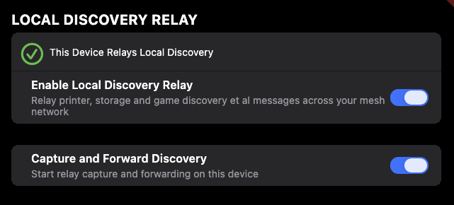

# L2 Discovery Relay

Cylonix can relay Layer 2 discovery protocols across the mesh network, so devices on
different LANs can find each other's services as if they were on the same local
network. The classic use cases are **printer discovery** and **NAS / network share
discovery** across sites.

**Supported protocols:**
- **mDNS** (Multicast DNS / Bonjour / Avahi) — used by printers, NAS boxes, Apple
  devices, and most cross-platform services
- **WSD** (Web Services for Devices) — used by Windows for network printer and
  device discovery

SSDP, NetBIOS/WINS, and other broadcast discovery protocols are not relayed.

> ⚠️ **Public Wi-Fi warning:** Disable the relay when connected to a public or
> untrusted Wi-Fi network. With relay enabled, the device captures and forwards local
> network discovery traffic to your mesh peers, which is inappropriate on a network
> you do not control.

---

## How It Works

mDNS and WSD are multicast-only and do not cross IP subnet boundaries. The L2 relay
feature bridges this gap by having Cylonix nodes act as lightweight proxies:

1. A **relay** node on one LAN captures outgoing multicast queries from local devices
   and forwards them over the encrypted mesh to remote peers.
2. An **injector** node on a remote LAN receives those forwarded queries, multicasts
   them onto its local network, collects the unicast responses, and sends them back
   through the mesh.
3. Optionally, a **discoverable-service** node (e.g. a NAS) rewrites its hostname in
   mDNS responses to its stable mesh domain name, so remote clients can connect
   directly over the mesh without needing a subnet router.

---

## Network Topology

The diagram below shows the reference setup used in this guide.

```
               ┌──────────────────────────────────────────────────────┐
               │                 Cylonix Mesh Network                 │
               │       (WireGuard-encrypted overlay, *.cylonix.org)   │
               └──────────────────┬───────────────────┬───────────────┘
                                  │   mesh tunnels    │
    ──────────────────────────────┼───────────────────┼─────────────────────
              LAN 1               │  192.168.1.0/24   │          LAN 2
                                  │                   │      192.168.2.0/24
    ──────────────────────────────┼───────────────────┼─────────────────────
                                  │                   │
  ┌────────────────────┐   ┌──────┴─────────────┐   ┌─┴───────────────────┐
  │ Printer            │   │ Linux PC           │   │ Windows PC          │
  │ 192.168.1.5        │   │ 192.168.1.10       │   │ 192.168.2.20        │
  │                    │   │                    │   │                     │
  │ (no Cylonix)       │   │ Cylonix            │   │ Cylonix             │
  └────────────────────┘   │ [Relay] [Inject]   │   │ [Relay] [Inject]    │
                           │ [Subnet Router]    │   └─────────────────────┘
  ┌────────────────────┐   │  192.168.1.0/24    │
  │ Synology NAS       │   └────────────────────┘   ┌─────────────────────┐
  │ 192.168.1.20       │                            │ iPhone              │
  │                    │                            │ 192.168.2.x         │
  │ Cylonix SPK        │                            │                     │
  │ [L2 Service]       │                            │ Cylonix             │
  │                    │                            │ [Relay]             │
  │ Mesh name:         │                            │ (relay only,        │
  │ ds124-24t.         │                            │  iOS sandboxed)     │
  │ cy123456.          │                            └─────────────────────┘
  │ cylonix.org        │
  └────────────────────┘
```

### Capability roles in this setup

| Device          | Relay | Inject | L2 Service | Subnet Router |
|-----------------|:-----:|:------:|:----------:|:-------------:|
| Printer         | —     | —      | —          | —             |
| Linux PC        | ✔     | ✔      | —          | ✔             |
| Synology NAS    | —     | —      | ✔          | —             |
| Windows PC      | ✔     | ✔      | —          | —             |
| iPhone          | ✔     | —      | —          | —             |

All capabilities can be set either from the **device app** (master toggle) or from
the **admin web portal → machine details page** for that node. The app toggle is a
convenience shortcut that sets the platform-appropriate capabilities automatically;
the admin portal lets you set any capability on any node individually.

The iPhone's relay capability means it can forward its own LAN 2 mDNS queries to
mesh peers, but Windows is needed to inject remote queries onto LAN 2 because iOS
cannot send multicast.

The Linux PC carries the full relay + inject + subnet router burden for LAN 1 because
it is always on. Windows carries relay + inject for LAN 2 when it is online.

> **Tip — Android TV as a relay node:** Android TV devices (e.g. NVIDIA Shield,
> Google TV) are excellent always-on relay + inject + subnet router nodes. They
> typically run 24/7, support wired Ethernet, and as Android devices they support the
> full relay + inject capability set.

---

## Capability Flags Explained

### `can-relay-l2-discovery` — Relay

Enable this on any always-on device that is the best-connected node on its LAN.

**What it does:** Listens for mDNS and WSD multicast queries originating on the local
LAN. When a query arrives, the node forwards it over the mesh to all peers that have
the inject capability. It also receives forwarded *responses* from remote injectors
and re-announces them locally so that the original querying device sees the answer.

**When to enable:** Desktop PCs, Linux servers, NAS devices, Android TV boxes —
nodes that are online most of the time. Enabling it on a phone is possible but will
drain battery as the device must keep the VPN socket awake to listen. Always disable
it on public or untrusted Wi-Fi.

**How to enable:** Use the master toggle in the device app, or set it individually
in the **admin web portal → machine details page** for the node.

### `can-inject-l2-discovery` — Inject

Enable this on one node per LAN that has services you want to make discoverable.

**What it does:** Receives a relayed mDNS or WSD query from the mesh, multicasts it
onto the local LAN, and collects the unicast responses that come back. Those responses
are relayed back to the originating peer, which hands them to the querying device.

**When to enable:** The same always-on node that acts as relay, if it is on the LAN
that contains the target services. In the diagram above, both the Linux PC (LAN 1)
and Windows (LAN 2) have inject enabled so that either side can answer queries from
the other.

**How to enable:** Use the master toggle in the device app (Linux/Windows/Android
only — iOS/macOS cannot inject), or set it individually in the **admin web portal →
machine details page** for the node.

### `has-l2-discoverable-service` — L2 Service

Set this on devices that run a named service (NAS, media server, print server) and
have Cylonix installed.

**What it does:** When the device responds to an mDNS or WSD query that was injected
by a remote relay, Cylonix rewrites the `hostname` field in the response to the
device's stable mesh domain name (e.g. `ds124-24t.cy123456.cylonix.org`). The remote
client therefore receives a hostname it can reach directly over the mesh — no subnet
router required for that service.

**Where to set it:** Enable this from the **admin web portal → machine details page**
for the device, or from the device app if the app is installed. Using the admin
portal is recommended for NAS devices since it allows central management without
requiring a logged-in session on the device itself.

**When to set it:** NAS boxes (Synology, QNAP), home servers, or any device that has
a stable mesh identity and runs a service you want remote clients to connect to over
the mesh rather than through a subnet router.

---

## Scenario A — iPhone Discovers and Prints to Printer in LAN 1

The printer has no Cylonix app installed. Its LAN address (`192.168.1.5`) must be
routable over the mesh via the Linux subnet router.

This scenario also covers the case where the iPhone is the **only Cylonix device on
its network** (e.g. on a cellular connection or hotel Wi-Fi). Because the iPhone's
relay sends its own queries directly over the mesh to the Linux injector on LAN 1, no
relay node is needed on the iPhone's side.

```
iPhone (LAN 2)          Windows (LAN 2)       Linux (LAN 1)        Printer (LAN 1)
     │                        │                     │                     │
     │─ mDNS query ──────────▶│                     │                     │
     │  "_ipp._tcp.local"     │── relay over mesh ─▶│                     │
     │                        │                     │─ mDNS inject ──────▶│
     │                        │                     │  (multicast LAN 1)  │
     │                        │                     │◀─ unicast response ─│
     │                        │                     │  src: 192.168.1.5   │
     │                        │◀─ relay response ───│                     │
     │◀─ mDNS response ───────│                     │                     │
     │   addr: 192.168.1.5    │                     │                     │
     │                        │                     │                     │
     │══ print traffic (TCP) ════════════════════▶  │                     │
     │   to 192.168.1.5       │                     │── subnet-routed ───▶│
```

**Requirements:**
- Linux PC: **Relay + Inject + Subnet Router** all enabled
- Windows PC: **Relay** enabled (captures iPhone's query on LAN 2)
- Subnet router must advertise `192.168.1.0/24` so that iPhone's print traffic
  can reach `192.168.1.5` through the mesh

**iPhone-only variant (no Windows):** The iPhone's relay sends its query directly to
Linux over the mesh. Windows is not required — the flow skips the Windows column
above. The iPhone still needs the subnet router on Linux to reach `192.168.1.5`.

> ⚠️ **Without the subnet router, discovery will succeed but printing will fail.**
> The iPhone will receive `192.168.1.5` as the printer address, but that address is
> not reachable from LAN 2 without the Linux node routing traffic for that subnet.

---

## Scenario B — Windows Discovers the Synology NAS in LAN 1

The NAS has the Cylonix SPK installed and has `has-l2-discoverable-service` enabled.
Its mesh hostname (`ds124-24t.cy123456.cylonix.org`) is always reachable from any
mesh peer regardless of subnet routing.

Windows discovery uses both **mDNS** and **WSD**. The NAS will appear in Windows
Explorer as a network computer and storage device. WSD discovery can take a few
seconds longer than mDNS — if the NAS does not appear immediately, wait 10–15
seconds before retrying.

```
Windows (LAN 2)         Linux (LAN 1)           Synology NAS (LAN 1)
     │                       │                          │
     │─ mDNS / WSD query ───▶│  (Windows relays its     │
     │  "_smb._tcp.local"    │   own query to peers)    │
     │                       │─ inject (multicast) ────▶│
     │                       │                          │ Cylonix rewrites hostname:
     │                       │◀─ unicast response ──────│
     │                       │  host: ds124-24t.        │ (was: ds124-24t.local)
     │                       │        cy123456.         │
     │                       │        cylonix.org       │
     │◀─ relay response ─────│                          │
     │  host: ds124-24t.cy123456.cylonix.org            │
     │  addr: <mesh IP>      │                          │
     │                       │                          │
     │══ SMB / file access (direct over mesh) ═════════▶ NAS
```

**Requirements:**
- Linux PC: **Relay + Inject** enabled (captures and injects on LAN 1)
- Windows PC: **Relay** enabled (so it forwards its own query to LAN 1 peers)
- Synology NAS: **L2 Service** enabled (rewrites hostname in response)

> No subnet router is needed for NAS access. Windows connects to
> `ds124-24t.cy123456.cylonix.org` directly over the WireGuard mesh.

---

## Setup Guide

### Step 1 — Identify Roles for Each Device

For each LAN, pick **one always-on device** to act as the relay/inject node for that
LAN. In our example:

| LAN   | Relay + Inject node | Notes                                          |
|-------|---------------------|------------------------------------------------|
| LAN 1 | Linux PC            | Also enable subnet router for printer access   |
| LAN 2 | Windows PC          | Can also be an Android TV or Linux server      |

### Step 2 — Enable Capabilities in the App

Open the Cylonix app on each device and navigate to **Settings → Local Discovery
Relay**. The settings screen looks like this:



The two toggles are:

| Toggle | What it does |
|--------|-------------|
| **Enable Local Discovery Relay** | Registers this device as a relay peer and sets its capabilities on the mesh. The exact capabilities set depend on the platform — see the table below. |
| **Capture and Forward Discovery** | Starts or stops the relay service on this device. When off, the device stops forwarding discovery traffic and peers will no longer route queries through it. Useful on mobile devices to save power when relay coverage is not needed. |

The status badge at the top ("This Device Relays Local Discovery") confirms the
device is registered and active.

#### Platform capabilities set by the master toggle

| Platform    | `can-relay-l2-discovery` | `can-inject-l2-discovery` |
|-------------|:------------------------:|:-------------------------:|
| Linux       | ✔                        | ✔                         |
| Windows     | ✔                        | ✔                         |
| Android     | ✔                        | ✔                         |
| iOS / macOS | ✔                        | —                         |

Apple devices are sandboxed and cannot send multicast traffic to their local
network, so the inject capability is not set. An iPhone or Mac can still **relay**
— it captures mDNS queries from its LAN and forwards them to mesh peers — but it
cannot be the node that injects a remote query onto its local network. For inject
coverage on an Apple-only LAN, a Linux, Windows, or Android device must be present.

---

**Linux PC (LAN 1 — relay + inject + subnet router):**
1. Enable **"Enable Local Discovery Relay"**
2. Enable **"Capture and Forward Discovery"**
3. In the main network settings, enable **Subnet Router** and advertise
   `192.168.1.0/24`

**Windows PC (LAN 2 — relay + inject):**
1. Enable **"Enable Local Discovery Relay"**
2. Enable **"Capture and Forward Discovery"**

**Synology NAS (LAN 1 — L2 discoverable service):**
1. Install the Cylonix SPK package
2. Enable **"L2 Discoverable Service"** either from the NAS app or from the
   **admin web portal → machine details page** for the NAS node

**iPhone (LAN 2 — relay only):**
1. Enable **"Enable Local Discovery Relay"**
2. Enable **"Capture and Forward Discovery"**

On iOS, the master toggle sets only the relay capability (not inject). The iPhone
will forward its own mDNS queries to mesh peers. Windows handles injection onto
LAN 2 for queries arriving from LAN 1 peers.

### Step 3 — Accept the Subnet Router in Admin Console

The Linux subnet router advertisement for `192.168.1.0/24` must be approved in the
Cylonix admin console before remote devices can route traffic to LAN 1. Verify that
the route appears in the network map and is marked as accepted.

### Step 4 — Test Discovery

On the iPhone or Windows PC, open the system print dialog or file browser. The
printer and NAS should appear as if they were on the local network. Allow 10–30
seconds for the first discovery cycle to complete after enabling the relay.

WSD-based discovery (Windows network shares, NAS in Explorer) may take a few extra
seconds to populate. If the NAS does not appear immediately, wait 10–15 seconds
before retrying from the client side (e.g. refreshing the Windows Explorer network
view or reopening the print dialog).

---

## Troubleshooting

### Discovery works but printing fails

The mDNS response is being relayed correctly, but print traffic cannot reach the
printer. Check:
- The Linux subnet router has `192.168.1.0/24` advertised **and accepted** in the
  admin console.
- The Linux PC is online and the Cylonix tunnel is up.

### NAS appears with its `.local` name instead of `.cylonix.org`

The `has-l2-discoverable-service` capability is not set, or the Cylonix SPK is not
running. Check:
- In the **admin web portal → machine details page** for the NAS, confirm the
  **"L2 Discoverable Service"** capability is enabled.
- On the NAS itself, confirm the Cylonix SPK package is installed and running.

### NAS does not appear in Windows Explorer immediately

WSD discovery is slower than mDNS. Wait 10–15 seconds, then refresh the Windows
Explorer network view or reopen the print dialog to trigger a new query from the
client side.

### Nothing is discovered at all

- Confirm that at least one device on each LAN has **Relay** enabled and is online.
- Confirm that at least one device on the target LAN has **Inject** enabled.
- Check that the relay nodes are peered (visible to each other in the network map).
- Check the app logs for relay activity to confirm queries are being captured and
  forwarded.

### Discovery works intermittently

mDNS queries are time-limited. If the relay node on LAN 2 is a laptop or phone that
goes to sleep, queries will stop being forwarded. Move the relay role to an always-on
device such as a desktop PC, Linux server, or Android TV box.

---

## Limitations

- **Printers without Cylonix require a subnet router.** The printer's raw LAN IP is
  what gets returned in the mDNS response; remote clients must be able to route to
  that IP.
- **One relay node per LAN is sufficient.** Running relay + inject on multiple nodes
  on the same LAN will cause duplicate query injection. Keep one node as the active
  relay per LAN.
- **mDNS and WSD only.** SSDP (used by UPnP/DLNA), NetBIOS/WINS, and DNS-SD over
  unicast are not relayed.
- **Disable on public Wi-Fi.** When connected to a public or shared network, turn off
  the relay to avoid capturing and forwarding local network traffic to your mesh.
